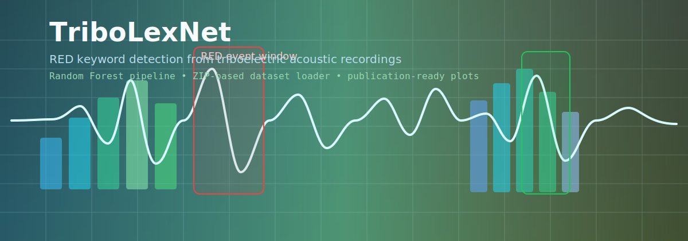

# TriboLexNet



TriboLexNet includes a RED keyword Random Forest pipeline, an RGB ROC analysis script, and an ML learning-curve script.

## Included Data Scope

Included ZIPs in `data/`:

- `Red_story_231125.zip`
- `not_RED_speaking.zip`
- `5 times Red.zip`
- `Red 100x 10Hz.zip`
- `Red 100x 13Hz.zip`
- `blue 100x 10Hz.zip`
- `Green 100x 13Hz.zip`

## Repository Structure

```text
.
|- assets/
|  `- tribolexnet_acoustic_banner.svg
|- data/
|  |- 5 times Red.zip
|  |- Red 100x 10Hz.zip
|  |- Red 100x 13Hz.zip
|  |- Red_story_231125.zip
|  |- not_RED_speaking.zip
|  |- blue 100x 10Hz.zip
|  `- Green 100x 13Hz.zip
|- tribolexnet_red_rf/
|  |- __init__.py
|  |- cli.py
|  |- core.py
|  `- plotting.py
|- red_detect_rf_publi_rgb_pre.py
|- red_keyword_detection_mlplots.py
|- roc_colors_ml.py
|- .gitignore
`- README.md
```

## Refactor Summary (professionalized layout)

The original monolithic RED RF script was reorganized into a small package:

- `tribolexnet_red_rf/core.py`
  - ZIP loading
  - signal normalization / envelope / peak utilities
  - handcrafted feature extraction
  - Random Forest training and sliding-window inference
- `tribolexnet_red_rf/plotting.py`
  - uniform plotting style
  - confusion matrix / feature importance / histogram plots
  - example detection plots and combined 2x2 summary figure
- `tribolexnet_red_rf/cli.py`
  - command-line argument parsing
  - end-to-end pipeline orchestration
- `red_detect_rf_publi_rgb_pre.py`
  - thin backward-compatible entry point

## Included Scripts

### 1) RED keyword Random Forest pipeline (main)

- Entry point: `red_detect_rf_publi_rgb_pre.py`
- Refactored implementation: `tribolexnet_red_rf/`
- Purpose: RED keyword spotting with handcrafted features with Random Forest

### 2) ML learning curves / AUC curves (RED vs not-RED)

- Script: `red_keyword_detection_mlplots.py`
- Purpose: train/validation loss and AUC curves across learning-rate sweeps
- Default inputs:
  - `data/Red_story_231125.zip`
  - `data/not_RED_speaking.zip`

### 3) RGB ROC experiments (BLUE / RED / GREEN vs negative)

- Script: `roc_colors_ml.py`
- Purpose: generate ROC curves and AUC tables for BLUE/RED/GREEN one-vs-negative experiments
- Default inputs:
  - `data/blue 100x 10Hz.zip`
  - `data/Red 100x 10Hz.zip`
  - `data/Green 100x 13Hz.zip`
  - `data/not_RED_speaking.zip`

## Pipeline Overview 

The RED RF pipeline performs:

1. Sentence-level dataset loading (`RED` vs `non-RED`) from ZIP files
2. RED pulse duration estimation from single-word RED recordings
3. Segment extraction around RED pulse candidates
4. Handcrafted feature generation (time + spectral descriptors)
5. Segment-level Random Forest training
6. Sliding-window inference over sentence recordings
7. Clustering of high-probability windows into RED events

## Requirements

Python 3.10+ is recommended.

Install core dependencies:

```bash
pip install numpy pandas scikit-learn matplotlib
```

Optional dependency for `roc_colors_ml.py`:

```bash
pip install torch
```

## Usage

Run the pipeline with default paths (`data/` -> `outputs/`):

```bash
python red_detect_rf_publi_rgb_pre.py
```

Explicit paths:

```bash
python red_detect_rf_publi_rgb_pre.py --input_dir ./data --out_dir ./outputs
```

Save all waveform example detections:

```bash
python red_detect_rf_publi_rgb_pre.py --n_example_plots -1
```

```bash
python red_detect_rf_publi_rgb_pre.py --dpi 600 --font_base 18 --topk 5
```

## Reproducibility Notes

- Segment-level train/validation split uses fixed `random_state`
- Random Forest uses a fixed `random_state`
- Other scripts also set explicit seeds where applicable
- Exact results may vary slightly across library versions / hardware
